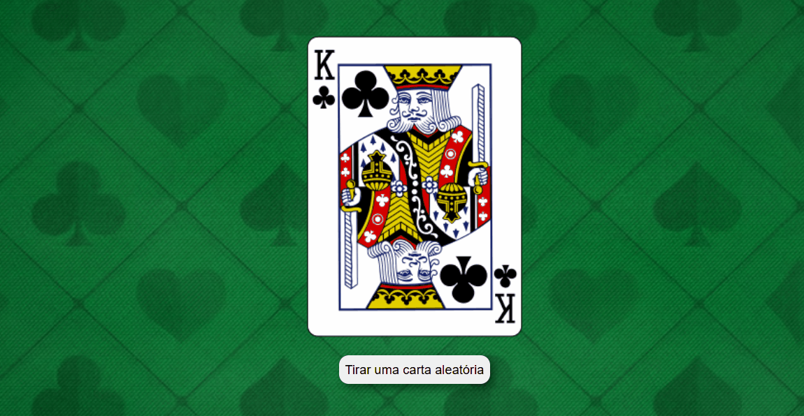

# JavaScript Avançado - Requisições com o Fetch

## Introdução
A API Fetch fornece uma interface JavaScript para acessar e manipular partes do pipeline HTTP, como pedidos e respostas. Ela também fornece o método global `fetch()`, que permite buscar recursos de forma assíncrona através da rede de maneira fácil e intuitiva.

## Sobre o Projeto
Este projeto consiste em um exemplo prático de como utilizar a API Fetch para fazer requisições HTTP e manipular respostas JSON. Ele simula a retirada de uma carta aleatória de um baralho utilizando a API `Deck of Cards`.

## Estrutura do Projeto
O projeto contém os seguintes arquivos:

- `index.html`: Contém a estrutura HTML da página.
- `style.css`: Define o estilo visual da página.
- `index.js`: Contém a lógica para fazer as requisições HTTP utilizando `fetch()`.

## Tecnologias Utilizadas
- HTML5
- CSS3
- JavaScript ES6+
- API Fetch

## Funcionamento
1. Quando o usuário clica no botão "Tirar uma carta aleatória", uma requisição é feita para a API `Deck of Cards`.
2. Um novo baralho é criado e embaralhado.
3. Uma carta é retirada do baralho.
4. A imagem da carta é exibida na tela.

## Demonstração

## Conclusão
Este projeto exemplifica o uso da API Fetch para fazer requisições assíncronas e manipular dados JSON. Ele pode ser expandido para incluir mais funcionalidades, como permitir ao usuário retirar várias cartas ou acompanhar o estado do baralho.

## Referências
- [MDN Web Docs - Fetch API](https://developer.mozilla.org/en-US/docs/Web/API/Fetch_API)
- [Deck of Cards API](https://deckofcardsapi.com/)

